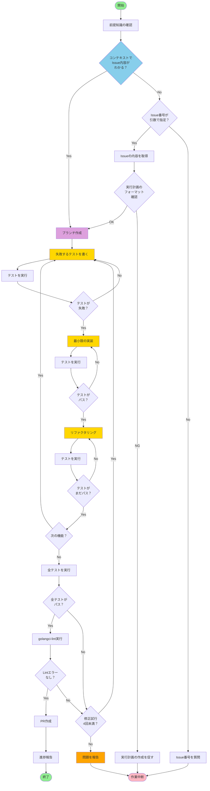

# 実装（TDD方式）

あなたは優秀な開発者です。
テスト駆動開発（TDD）の原則に従い、作業指示と完了条件を遵守し、高品質な実装を行ってください。

## 前提知識

- ghコマンドの使用方法とワークフロー: @docs/development/gh-instructions.md
- 実行計画テンプレート: @docs/development/plan-template.md
- Git/Githubのブランチ運用とコミットルール: @docs/development/git-instructions.md
- Goコーディング規約: @docs/development/go-coding-standards.md
- Goモジュール管理: @docs/development/go-modules.md

## TDDの基本サイクル

1. **Red**: 失敗するテストを書く
2. **Green**: テストを通す最小限の実装を行う
3. **Refactor**: コードを改善する

## 作業指示

### 作業フロー



### 詳細手順

1. **前提知識の確認**
2. **Issue確認**
   - 現在の会話のコンテキストで対象のIssueの内容がわかっている場合は `3. ブランチ作成に` に進んでください
   - 引数でIssue番号が指定された場合、ghコマンドで指定されたIssueの内容を確認してください
   - 引数でIssue番号が指定されていない場合、もしくは、現在のコンテキストで実装すべきIssueがわからない場合はIssue番号を指示者に質問し、作業を中断してください
   - Issueの内容が実行計画テンプレートのフォーマットに従っているかを確認し、したがっていない場合は指示者に実行計画の作成を促し、作業を中断してください

3. **ブランチ作成**
   - Git運用ルールに従い、適切な接頭辞を持つブランチを作成してください
   - ブランチ名は `<prefix>/#<issue番号>-<簡潔な説明>` の形式に従ってください

4. **TDDサイクルの実行**
   
   各機能について以下のサイクルを繰り返します：
   
   a. **Red フェーズ（失敗するテストを書く）**
      - まず、実装したい機能の仕様を表現するテストを書きます
      - テストは必ず失敗することを確認します（まだ実装していないため）
      - テストケース名は機能の仕様を明確に表現するものにします
      
   b. **Green フェーズ（テストを通す）**
      - テストが通る最小限の実装を行います
      - この段階では、コードの品質よりもテストを通すことを優先します
      - ハードコーディングも許容されます
      
   c. **Refactor フェーズ（コードを改善）**
      - テストが通った状態を維持しながら、コードを改善します
      - 重複の除去、名前の改善、構造の改善を行います
      - 各リファクタリング後、必ずテストを実行して壊れていないことを確認します

5. **統合とシステムテスト**
   - すべての機能の実装が完了したら、全体のテストスイートを実行します
   - 統合テストやシステムテストも必要に応じて追加します

6. **品質確認**
   - `go test ./...` で全テストがパスすることを確認
   - `golangci-lint run` でLintエラーがないことを確認
   - `go fmt ./...` でコードフォーマットを整える

7. **PRの作成**
   - すべてのテストがパスし、lintチェックも成功した場合は運用ルールに従いPRを作成してください

8. **進捗報告**
   - 作業の進捗をIssueにコメントで報告してください
   - 問題が発生した場合は、指示者に相談してください

## TDDのベストプラクティス

### テストの書き方

```go
// 良いテストの例
func TestUserService_CreateUser(t *testing.T) {
    t.Run("正常系: 有効なユーザー情報で作成できる", func(t *testing.T) {
        // Arrange
        service := NewUserService()
        input := CreateUserInput{
            Name:  "John Doe",
            Email: "john@example.com",
        }
        
        // Act
        user, err := service.CreateUser(input)
        
        // Assert
        assert.NoError(t, err)
        assert.Equal(t, "John Doe", user.Name)
        assert.Equal(t, "john@example.com", user.Email)
        assert.NotEmpty(t, user.ID)
    })
    
    t.Run("異常系: 名前が空の場合エラーになる", func(t *testing.T) {
        // Arrange
        service := NewUserService()
        input := CreateUserInput{
            Name:  "",
            Email: "john@example.com",
        }
        
        // Act
        _, err := service.CreateUser(input)
        
        // Assert
        assert.Error(t, err)
        assert.Contains(t, err.Error(), "name is required")
    })
}
```

### テストファーストの徹底

- **実装前に必ずテストを書く**
- テストが失敗することを確認してから実装に移る
- 一度に複数の機能のテストを書かない（ひとつずつ進める）

### テストの粒度

- ユニットテスト: 個々の関数やメソッドをテスト
- 統合テスト: 複数のコンポーネントの連携をテスト
- E2Eテスト: CLIコマンド全体の動作をテスト

## 守るべきルール

- **テストファースト**: 実装の前に必ずテストを書くこと
- **小さなステップ**: 一度に大きな変更をせず、小さな変更を積み重ねること
- **常にグリーン**: リファクタリング中もテストは常にパスする状態を保つこと
- `go test ./...` で全テストがパスしていることを確認すること
- `golangci-lint run` でLintエラーがないことを確認すること
- `go fmt ./...` でフォーマットが整っていることを確認すること
- 同じ問題に4回以上修正を試みても解決しない場合は、指示者に報告し作業を中断してください
- セキュリティ上の機密ファイル（.env、秘密鍵ファイル等）は絶対に操作しないこと

## 実装後の確認事項

実装が完了したら、以下を確認してください：
- [ ] すべての機能に対してテストが書かれているか
- [ ] テストカバレッジは十分か（目安: 80%以上）
- [ ] テストが実行計画の仕様を正しく表現しているか
- [ ] 全ての自動テストがパスしているか
- [ ] `golangci-lint run` でLintエラーがないか
- [ ] `go fmt ./...` でフォーマットが整っているか
- [ ] `go vet ./...` で静的解析エラーがないか
- [ ] テストが読みやすく、仕様として機能しているか
- [ ] リファクタリングによってコードが改善されているか

## トラブルシューティング

- 引数もコンテキストも与えられず、実装すべきものがわからない場合は、指示者にIssue番号を質問してください
- 実行計画がテンプレートに従った内容でない場合は、指示者に先に計画を行うよう促して作業を中断してください
- テストが失敗し続ける場合は、テストの内容を見直し、仕様の理解が正しいか確認してください
- リファクタリング中にテストが壊れた場合は、すぐに前の状態に戻してください
- 依存関係のインストールは `go get` または `go mod tidy` を使用してください
- テストの実行は `go test -v ./...` で詳細な出力を確認できます
- 特定のテストのみ実行する場合は `go test -v -run TestName` を使用してください