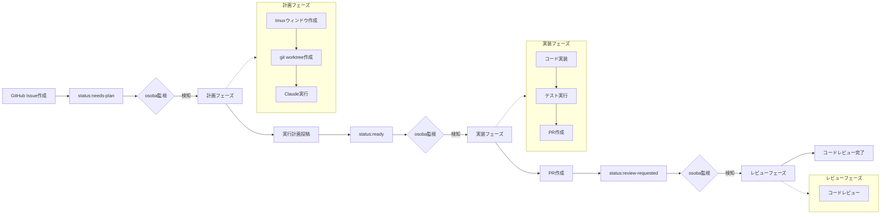

```
                     _           
   ___  ___  ___   | |__    __ _ 
  / _ \/ __|/ _ \  | '_ \  / _` |
 | (_) \__ \ (_) | | |_) || (_| |
  \___/|___/\___/  |_.__/  \__,_|
                                 
```

# osoba - 自律的ソフトウェア開発支援ツール

[](https://github.com/douhashi/osoba/actions/workflows/ci.yml)
[](https://github.com/douhashi/osoba/actions/workflows/release.yml)
[](https://goreportcard.com/report/github.com/douhashi/osoba)
[](https://go.dev/)
[](https://opensource.org/licenses/MIT)

## 概要

osobaは、tmux + git worktree + Claude を統合した自律的なソフトウェア開発支援CLIツールです。GitHub Issueをトリガーとして、AIが計画・実装・レビューの各フェーズを自律的に実行し、開発プロセスを大幅に効率化します。

### 主な特徴

- 🤖 **自律的な開発フロー**: GitHub Issueのラベルに基づいた自動的なタスク実行
- 🖥️ **tmuxセッション管理**: リポジトリ・Issue単位での独立した開発環境
- 🌳 **git worktree統合**: Issueごとの独立したブランチとワークツリー
- 🧠 **Claude AI統合**: フェーズごとに最適化されたプロンプト実行
- 🔄 **継続的な監視**: Issueを監視し、自動的にアクションを実行

## セキュリティ上の注意事項

⚠️ **重要**: osobaは自律性を最大化するため、Claude実行時に`--dangerously-skip-permissions`オプションを使用します。セキュリティリスクがあることを理解した上で使用してください。

devcontainerや隔離された環境で実行するなど、可能な限りのセキュリティ対策を行ったうえで使用してください。


### 設計の背景

この設計選択は、開発プロセスの完全自律化を実現するために行われました。一般的な権限制限では、ファイル作成・編集、テスト実行、Git操作などの開発に必要な操作が制限されるため、`--dangerously-skip-permissions`オプションを採用しています。

### 代替案

より安全な使用を希望する場合は、`.osoba.yml` に以下の設定変更を検討してください：

```yaml
claude:
  phases:
    plan:
      args: []  # remove --dangerously-skip-permissions
    implement:
      args: []
    review:
      args: []
```

## 必要な環境

- **対応OS**: Linux, macOS（Windows非対応）
- tmux 3.0以上
- git 2.x以上
- GitHub CLI（gh）
- Claude CLI（claude）

### GitHub認証

osobaはデフォルトでGitHub CLI（gh）を使用してGitHubにアクセスします。事前にghでログインしてください：

```bash
gh auth login
```

## インストール

### クイックインストール

最も簡単なインストール方法です。お使いのプラットフォームを自動判定してインストールします。

```bash
curl -L https://github.com/douhashi/osoba/releases/latest/download/osoba_$(uname -s | tr '[:upper:]' '[:lower:]')_$(uname -m | sed 's/x86_64/x86_64/; s/aarch64/arm64/').tar.gz | tar xz && sudo mv osoba /usr/local/bin/
```

### プラットフォーム別インストール

手動でプラットフォームを指定してインストールする場合は、[GitHub Releases](https://github.com/douhashi/osoba/releases)から適切なファイルをダウンロードしてください。

```bash
# Linux (x86_64)
curl -L https://github.com/douhashi/osoba/releases/latest/download/osoba_linux_x86_64.tar.gz | tar xz
sudo mv osoba /usr/local/bin/

# Linux (ARM64)
curl -L https://github.com/douhashi/osoba/releases/latest/download/osoba_linux_arm64.tar.gz | tar xz
sudo mv osoba /usr/local/bin/

# macOS (x86_64 / Intel)
curl -L https://github.com/douhashi/osoba/releases/latest/download/osoba_darwin_x86_64.tar.gz | tar xz
sudo mv osoba /usr/local/bin/

# macOS (ARM64 / Apple Silicon)
curl -L https://github.com/douhashi/osoba/releases/latest/download/osoba_darwin_arm64.tar.gz | tar xz
sudo mv osoba /usr/local/bin/
```

### ソースからのビルド

```bash
# リポジトリのクローン
git clone https://github.com/douhashi/osoba.git
cd osoba

# ビルドとインストール
make install
# または
go install
```

## クイックスタート

### 1. 初期設定

```bash
# GitHubにログイン（未ログインの場合）
gh auth login

# osobaの初期設定を実行
osoba init

※ .claude/commands 以下に osoba 用のコマンドが生成されます
```

### 2. 基本的な使い方

```bash
# リポジトリでosobaを開始
cd /path/to/your/repo
osoba start
```

### 3. リソースのクリーンアップ

```bash
# 特定のIssueに関連するリソースを削除
osoba clean 83

# 全てのIssue関連リソースを削除（確認プロンプトあり）
osoba clean --all
```

## 動作イメージ

### ラベル遷移と自動実行フロー



### 各フェーズの詳細

#### 計画フェーズ（Plan）
- **トリガー**: `status:needs-plan`ラベル
- **実行内容**:
  - Issue内容の解析
  - 実装計画の策定
  - 技術選定とアーキテクチャ設計
  - タスクの分解と優先度設定
- **アウトプット**: Issue本文への実行計画追記、`status:ready`ラベル更新

#### 実装フェーズ（Implementation）
- **トリガー**: `status:ready`ラベル
- **実行内容**:
  - 計画に基づいたコード実装
  - ユニットテストの作成
  - 統合テストの実行
  - コードスタイルの確認
- **アウトプット**: PR作成、`status:review-requested`ラベル更新

#### レビューフェーズ（Review）
- **トリガー**: `status:review-requested`ラベル
- **実行内容**:
  - コードレビューの実施
  - 品質チェック
  - 改善点の指摘とフィードバック
- **アウトプット**: レビュー完了（手動でのマージが必要）


## 詳細な設定

### 設定ファイルの構造

```yaml
# .osoba.yml
github:
  # ghコマンドを使用する（デフォルト: true）
  use_gh_command: true
  poll_interval: 10s

tmux:
  session_prefix: "osoba-"

claude:
  phases:
    plan:
      args: ["--dangerously-skip-permissions"]
      prompt: "/osoba:plan {{issue-number}}"
    implement:
      args: ["--dangerously-skip-permissions"]
      prompt: "/osoba:implement {{issue-number}}"
    review:
      args: ["--dangerously-skip-permissions"]
      prompt: "/osoba:review {{issue-number}}"
```

### 環境変数

osobaは環境変数での設定を必要としません。GitHub認証はghコマンドを通じて行います。


## セットアップ

### 開発環境のセットアップ

1. Go 1.24.5以上をインストール
2. 開発ツールをインストール:
   ```bash
   make install-tools
   # または手動で:
   go install golang.org/x/tools/cmd/goimports@latest
   export PATH=$PATH:$(go env GOPATH)/bin
   ```

3. Git hooksを有効化:
   ```bash
   git config core.hooksPath .githooks
   ```

### ビルド

```bash
go build
./osoba
```

### テスト

```bash
make test
```

### Lint

```bash
make lint
# または
go vet ./...
```

## 開発

### コミット前のチェック

Git pre-commit hookが自動的に以下をチェックします:
- `go fmt` - コードフォーマット
- `go vet` - 静的解析
- `go mod tidy` - 依存関係の整理

### プロジェクト構造

```
osoba/
├── cmd/         # CLIコマンド
├── internal/    # 内部パッケージ
├── pkg/         # 公開パッケージ
├── .githooks/   # Git hooks
└── Makefile      # ビルドタスク
```

## 開発者向け情報

## ライセンス

このプロジェクトは[MITライセンス](LICENSE)の下で公開されています。

