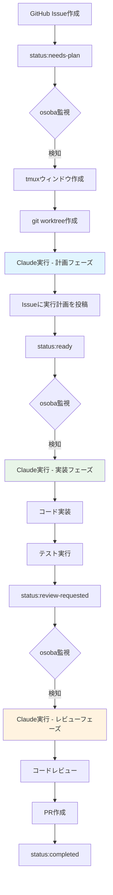

```
                     _           
   ___  ___  ___   | |__    __ _ 
  / _ \/ __|/ _ \  | '_ \  / _` |
 | (_) \__ \ (_) | | |_) || (_| |
  \___/|___/\___/  |_.__/  \__,_|
                                 
```

# osoba - 自律的ソフトウェア開発支援ツール

[](https://github.com/douhashi/osoba/actions/workflows/ci.yml)
[](https://github.com/douhashi/osoba/actions/workflows/release.yml)
[](https://goreportcard.com/report/github.com/douhashi/osoba)
[](https://go.dev/)
[](https://opensource.org/licenses/MIT)

## 概要

osobaは、tmux + git worktree + Claude を統合した自律的なソフトウェア開発支援CLIツールです。GitHub Issueをトリガーとして、AIが計画・実装・レビューの各フェーズを自律的に実行し、開発プロセスを大幅に効率化します。

### 主な特徴

- 🤖 **自律的な開発フロー**: GitHub Issueのラベルに基づいた自動的なタスク実行
- 🖥️ **tmuxセッション管理**: リポジトリ・Issue単位での独立した開発環境
- 🌳 **git worktree統合**: Issueごとの独立したブランチとワークツリー
- 🧠 **Claude AI統合**: フェーズごとに最適化されたプロンプト実行
- 🔄 **継続的な監視**: バックグラウンドでIssueを監視し、自動的にアクションを実行

## 必要な環境

- Go 1.21以上
- tmux 3.0以上
- git 2.x以上
- GitHub CLI（gh）
- Claude CLI（claude）

## インストール

### 推奨: Homebrewを使用（macOS/Linux）

```bash
# 近日公開予定
brew install douhashi/tap/osoba
```

### リリース版のインストール

最新のリリース版は[GitHub Releases](https://github.com/douhashi/osoba/releases)からダウンロードできます。

```bash
# Linux (amd64)
curl -L https://github.com/douhashi/osoba/releases/latest/download/osoba_Linux_x86_64.tar.gz | tar xz
sudo mv osoba /usr/local/bin/

# macOS (Apple Silicon)
curl -L https://github.com/douhashi/osoba/releases/latest/download/osoba_Darwin_arm64.tar.gz | tar xz
sudo mv osoba /usr/local/bin/
```

### ソースからのビルド

```bash
# リポジトリのクローン
git clone https://github.com/douhashi/osoba.git
cd osoba

# ビルドとインストール
make install
# または
go install
```

## クイックスタート

### 1. 初期設定

```bash
# 設定ファイルの作成
mkdir -p ~/.config/osoba
cat > ~/.config/osoba/config.yml << EOF
github:
  token: "${GITHUB_TOKEN}"
  poll_interval: 5m
tmux:
  session_prefix: "osoba-"
claude:
  model: "claude-3-opus-20240229"
EOF
```

### 2. 基本的な使い方

```bash
# リポジトリでosobaを開始
cd /path/to/your/repo
osoba start

# 別のターミナルでセッションに接続
osoba open
```

### 3. ワークフロー例

1. GitHub Issueを作成し、`status:needs-plan`ラベルを付与
2. osobaが自動的にIssueを検知し、計画フェーズを実行
3. 計画完了後、`status:ready`ラベルに更新
4. 実装フェーズが自動的に開始
5. `osoba open`でセッションに接続して進捗を確認

## 動作イメージ

### ラベル遷移と自動実行フロー



### 各フェーズの詳細

#### 計画フェーズ（Plan）
- **トリガー**: `status:needs-plan`ラベル
- **実行内容**:
  - Issue内容の解析
  - 実装計画の策定
  - 技術選定とアーキテクチャ設計
  - タスクの分解と優先度設定
- **アウトプット**: Issue本文への実行計画追記、`status:ready`ラベル更新

#### 実装フェーズ（Implementation）
- **トリガー**: `status:ready`ラベル
- **実行内容**:
  - 計画に基づいたコード実装
  - ユニットテストの作成
  - 統合テストの実行
  - コードスタイルの確認
- **アウトプット**: 実装完了、`status:review-requested`ラベル更新

#### レビューフェーズ（Review）
- **トリガー**: `status:review-requested`ラベル
- **実行内容**:
  - コードレビューの実施
  - 品質チェック
  - ドキュメント生成
  - プルリクエストの作成
- **アウトプット**: PR作成、`status:completed`ラベル更新

### 内部動作の詳細

#### tmuxセッション管理
- **セッション作成**: `osoba-{repository-name}`形式
- **ウィンドウ管理**: Issue番号ごとに独立したウィンドウ
- **ウィンドウ命名**: `{issue-number}-{phase}`（例: `53-plan`, `53-implement`）
- **ペイン分割**: Claude実行用、ログ監視用、コード編集用

#### git worktree統合
- **worktree作成**: `.git/osoba/worktrees/{issue-number}`
- **ブランチ管理**: `osoba/#{issue-number}-{description}`形式
- **同期処理**: mainブランチとの自動同期
- **クリーンアップ**: フェーズ完了後の自動worktree削除

#### Claude AI実行
- **プロンプト管理**: フェーズごとに最適化されたプロンプト
- **コンテキスト管理**: Issue情報、コードベース、プロジェクト情報を統合
- **実行制御**: 非同期実行、進捗監視、エラーハンドリング
- **結果反映**: Issue更新、コードコミット、ラベル更新

## 実使用例シナリオ

### シナリオ1: 新機能の実装

**状況**: REST APIに新しいエンドポイントを追加したい

1. **Issue作成**
   ```bash
   # GitHub上でIssueを作成
   タイトル: "feat: ユーザー検索APIエンドポイントを追加"
   説明: "ユーザー名とメールアドレスでユーザーを検索できるAPIエンドポイントを実装する"
   ラベル: "status:needs-plan"
   ```

2. **osoba起動**
   ```bash
   cd /path/to/your/api-project
   osoba start
   ```

3. **自動実行フロー**
   - osobaがIssueを検知し、計画フェーズを開始
   - `osoba-api-project`tmuxセッションに`55-plan`ウィンドウを作成
   - `.git/osoba/worktrees/55`にworktreeを作成
   - Claudeが実装計画を作成し、Issueに投稿
   - `status:ready`ラベルに自動更新

4. **進捗確認**
   ```bash
   osoba open  # tmuxセッションに接続
   # 55-implement ウィンドウで実装進捗を確認
   ```

5. **完了**
   - 実装、テスト、レビューが自動実行
   - PRが自動作成される

### シナリオ2: バグ修正

**状況**: ログイン機能にバグが発見された

1. **Issue作成**
   ```bash
   タイトル: "fix: パスワード忘れた場合のリセット機能が動作しない"
   説明: "パスワードリセットメールが送信されない問題を修正する"
   ラベル: "status:needs-plan", "bug"
   ```

2. **自動実行**
   - 計画フェーズで根本原因分析
   - 実装フェーズで修正とテスト
   - レビューフェーズで品質確認

3. **緊急対応**
   ```bash
   # 手動でセッションに接続して進捗確認
   osoba open
   # 必要に応じて手動介入
   ```

### シナリオ3: リファクタリング

**状況**: コードの構造改善が必要

1. **Issue作成**
   ```bash
   タイトル: "refactor: ユーザー認証ロジックをサービス層に移動"
   説明: "コントローラーに散在している認証ロジックを整理し、再利用性を向上させる"
   ラベル: "status:needs-plan", "refactor"
   ```

2. **段階的実行**
   - 計画フェーズで影響範囲の分析
   - 実装フェーズで段階的なリファクタリング
   - レビューフェーズで品質とテスト確認

### シナリオ4: 複数Issue並行処理

**状況**: 複数の機能を同時に開発

```bash
# 複数リポジトリを同時監視
osoba start --repos user/frontend,user/backend,user/mobile

# 各Issue（例：45, 46, 47）が同時に処理される
# tmuxセッション構成:
# - osoba-frontend: 45-plan, 45-implement
# - osoba-backend: 46-plan, 46-implement  
# - osoba-mobile: 47-plan, 47-implement
```

### シナリオ5: チーム開発での活用

**状況**: チームでの開発作業の効率化

1. **朝の作業準備**
   ```bash
   # 夜間に蓄積されたIssueを自動処理
   osoba start --background
   
   # 進捗確認
   osoba status
   # 出力例:
   # Issue #45: ready for review (PR #123 created)
   # Issue #46: implementing (60% complete)
   # Issue #47: planning (analyzing requirements)
   ```

2. **コードレビュー**
   ```bash
   # 自動生成されたPRを確認
   gh pr list --state open
   
   # 必要に応じて手動調整
   osoba open --issue 45
   ```

### よくある使用パターン

#### 開発者の日常ワークフロー
```bash
# 1. 朝の作業開始
osoba start --daemon

# 2. 進捗確認
osoba status

# 3. 必要に応じてセッション接続
osoba open

# 4. 夕方の作業終了
osoba pause  # 一時停止
```

#### プロジェクトマネージャーの監視
```bash
# 全プロジェクトの進捗確認
osoba dashboard

# 特定プロジェクトの詳細確認
osoba status --project user/important-project

# 週次レポート生成
osoba report --weekly
```

## 詳細な設定

### 設定ファイルの構造

```yaml
# ~/.config/osoba/config.yml
github:
  token: "ghp_xxxxxxxxxxxx"  # GitHub Personal Access Token
  poll_interval: 5m           # Issue監視間隔
  repos:                      # 監視するリポジトリ（省略時は現在のリポジトリ）
    - owner/repo1
    - owner/repo2

tmux:
  session_prefix: "osoba-"    # tmuxセッション名のプレフィックス
  window_layout: "tiled"      # ウィンドウレイアウト

claude:
  model: "claude-3-opus-20240229"
  max_tokens: 4096
  temperature: 0.7

log:
  level: "info"               # ログレベル: debug, info, warn, error
  file: "~/.osoba/osoba.log" # ログファイルのパス
```

### 環境変数

| 環境変数 | 説明 | デフォルト値 |
|----------|------|-------------|
| `OSOBA_CONFIG` | 設定ファイルのパス | `~/.config/osoba/config.yml` |
| `OSOBA_LOG_LEVEL` | ログレベル | `info` |
| `GITHUB_TOKEN` | GitHub Personal Access Token | - |

## セットアップ

### 開発環境のセットアップ

1. Go 1.24.5以上をインストール
2. 開発ツールをインストール:
   ```bash
   make install-tools
   # または手動で:
   go install golang.org/x/tools/cmd/goimports@latest
   export PATH=$PATH:$(go env GOPATH)/bin
   ```

3. Git hooksを有効化:
   ```bash
   git config core.hooksPath .githooks
   ```

### ビルド

```bash
go build
./osoba
```

### テスト

```bash
go test ./...
```

### Lint

```bash
make lint
# または
go vet ./...
```

## 開発

### コミット前のチェック

Git pre-commit hookが自動的に以下をチェックします:
- `go fmt` - コードフォーマット
- `go vet` - 静的解析
- `go mod tidy` - 依存関係の整理

### プロジェクト構造

```
osoba/
├── cmd/         # CLIコマンド
├── internal/    # 内部パッケージ
├── pkg/         # 公開パッケージ
├── .githooks/   # Git hooks
└── Makefile      # ビルドタスク
```

## CI/CD

このプロジェクトでは、GitHub Actionsを使用してCI/CDパイプラインを構築しています。

### CI ワークフロー

プルリクエストとmainブランチへのプッシュで以下が実行されます：

- **テスト**: `go test -v -race ./...`
- **ビルド**: 各プラットフォーム向けのクロスコンパイル
- **Lint**: `go vet` と `go fmt` による静的解析
- **コードカバレッジ**: Codecovへのレポート送信

### リリースワークフロー

タグプッシュ時に自動的にリリースが作成されます：

```bash
# バージョンタグを作成してプッシュ
git tag v0.1.0
git push origin v0.1.0
```

GoReleaserが以下のプラットフォーム向けバイナリを生成：
- Linux (amd64, arm64)
- macOS (amd64, arm64)
- Windows (amd64)

## 開発者向け情報

### Makefileタスク

```bash
make help        # 利用可能なタスクを表示
make build       # バイナリをビルド
make install     # バイナリをインストール
make test        # テストを実行
make lint        # lintを実行
make fmt         # コードフォーマット
make clean       # ビルド成果物をクリーン
make run         # アプリケーションを実行
```

## 貢献方法

プロジェクトへの貢献を歓迎します！詳細は[CONTRIBUTING.md](CONTRIBUTING.md)をご覧ください。

## ライセンス

このプロジェクトは[MITライセンス](LICENSE)の下で公開されています。

## 関連ドキュメント

- [プロジェクト概要](docs/development/project-brief.md)
- [Goコーディング規約](docs/development/go-coding-standards.md)
- [Git運用ルール](docs/development/git-instructions.md)
- [ghコマンドガイド](docs/development/gh-instructions.md)