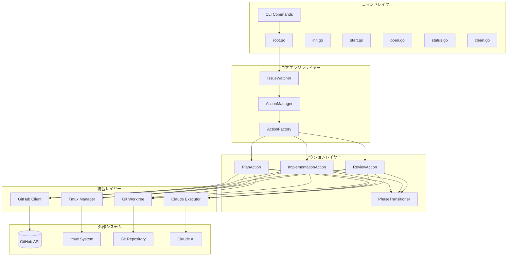
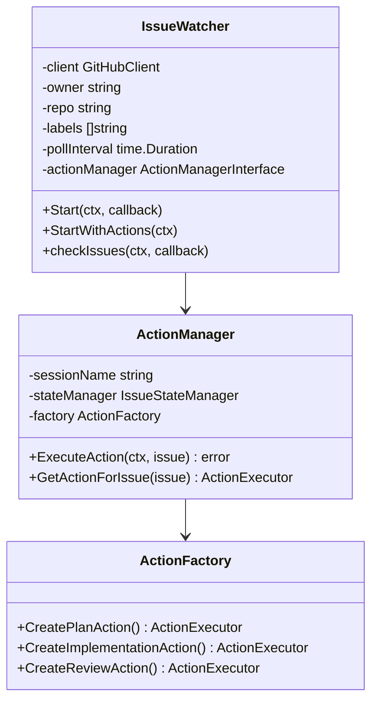
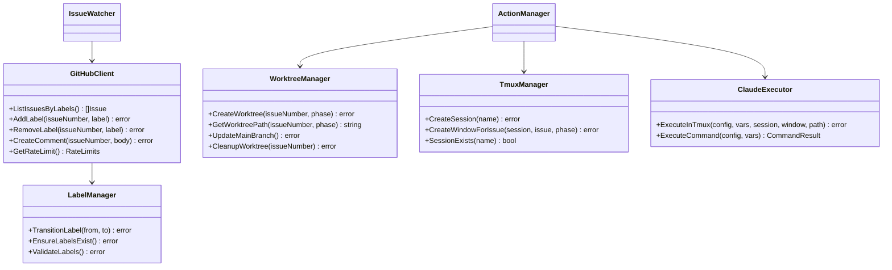
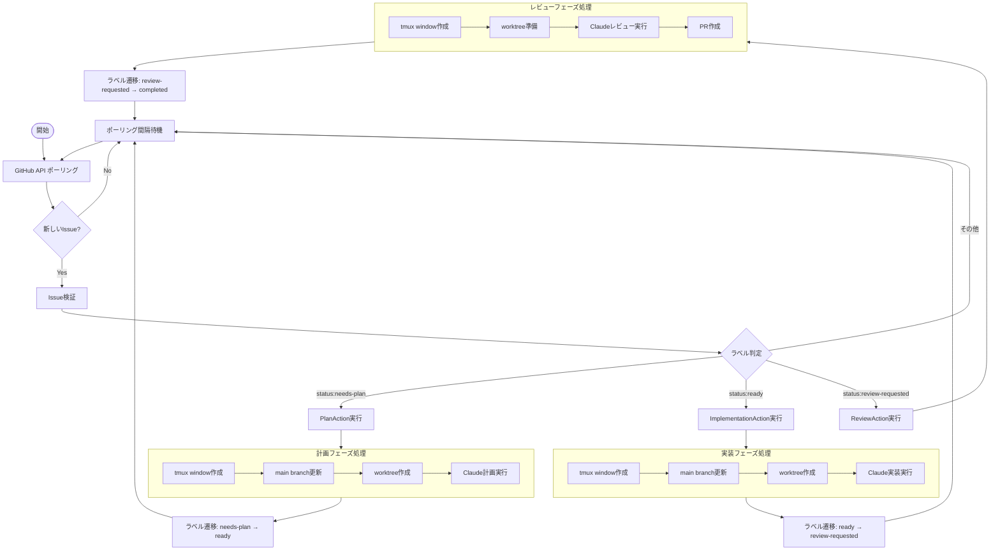
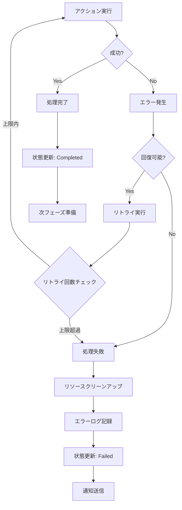
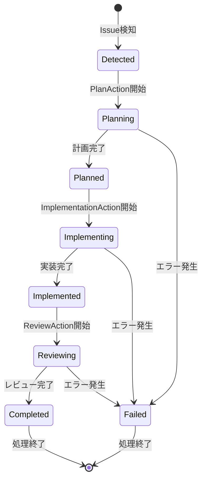
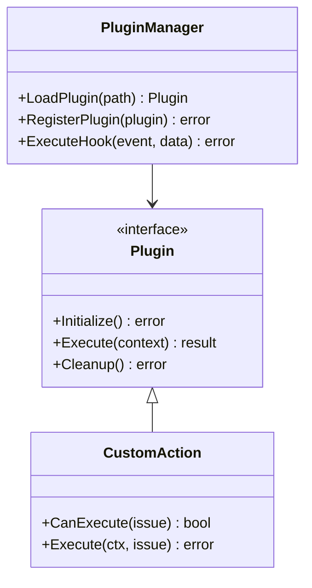

# アーキテクチャ設計書

## 概要

osobaは、GitHub Issue検知から自動的なラベル遷移まで、開発プロセス全体を自律的に管理するGoベースのCLIツールです。tmux + git worktree + Claude AI の統合により、計画・実装・レビューの3フェーズを自動実行します。

## システム全体構成

### 全体構成図



## コンポーネント詳細

### 1. コマンドレイヤー (cmd/)

ユーザーインターフェースとCLIコマンドの定義を担当。

| コマンド | 責務 | 実装ファイル |
|----------|------|-------------|
| `osoba init` | プロジェクト初期化 | cmd/init.go |
| `osoba start` | Issue監視開始 | cmd/start.go |
| `osoba open` | tmuxセッション接続 | cmd/open.go |
| `osoba status` | システム状況確認 | cmd/status.go |
| `osoba clean` | リソースクリーンアップ | cmd/clean.go |

### internal/watcher

システムの中核となるIssue監視とアクション実行エンジン。



#### 主要コンポーネント

- **IssueWatcher**: GitHub Issue監視の中核
  - ポーリングによるIssue検知
  - ラベル変更追跡
  - ヘルスチェック機能
  - イベント通知システム

- **ActionManager**: アクション実行の統括
  - Issue状態管理
  - アクション実行調整
  - フェーズ間の遷移制御

- **ActionFactory**: アクションインスタンス生成
  - ラベルベースのアクション選択
  - 依存性注入
  - テスト容易性の確保

### internal/github

GitHub API統合とラベル管理を担当。

### internal/tmux

tmuxセッション・ウィンドウ管理を担当。

### internal/git

git worktree操作とブランチ管理を担当。

### internal/claude

Claude AI実行管理とテンプレート処理を担当。

## 依存関係

各コンポーネント間の依存関係と呼び出し関係を示します。



## データフロー

### Issue検知からラベル遷移までの詳細フロー



### エラーハンドリングフロー



## 状態管理

### Issue状態遷移



### ラベル遷移マッピング

| 現在のラベル | 実行アクション | 遷移先ラベル | 条件 |
|-------------|---------------|-------------|------|
| `status:needs-plan` | PlanAction | `status:planning` → `status:ready` | 計画フェーズ完了 |
| `status:ready` | ImplementationAction | `status:implementing` → `status:review-requested` | 実装フェーズ完了 |
| `status:review-requested` | ReviewAction | `status:reviewing` → 完了 | レビューフェーズ完了 |

## セキュリティ考慮事項

### 1. 認証・認可

- **GitHub Token**: 環境変数または設定ファイルで管理
- **Claude API Key**: 暗号化して保存
- **最小権限の原則**: 必要最小限のスコープのみ

### 2. 入力検証

- **Issue内容の検証**: XSS、インジェクション攻撃防止
- **ラベル名の検証**: 予期しないラベル操作防止
- **コマンド実行の検証**: 任意コマンド実行防止

### 3. ログ・監査

- **機密情報のマスキング**: トークン、APIキーの自動マスキング
- **操作ログ**: 全ての重要操作をログ記録
- **アクセス制御**: ログファイルのアクセス権限管理

## パフォーマンス設計

### 1. 並行処理

- **goroutine活用**: 複数Issue並行処理
- **チャネル通信**: 安全な状態同期
- **コンテキスト制御**: タイムアウト・キャンセル処理

### 2. リソース管理

- **GitHub API レート制限**: 自動調整機能
- **tmux セッション**: 自動クリーンアップ
- **git worktree**: 容量監視・自動削除

### 3. キャッシュ戦略

- **Issue情報**: 短期メモリキャッシュ
- **GitHub APIレスポンス**: 適切なTTL設定
- **テンプレート**: 初回読み込み後キャッシュ

## 拡張性設計

### 1. プラグインアーキテクチャ



### 2. 設定システム

- **階層的設定**: プロジェクト → ユーザー → システム
- **動的リロード**: 設定変更の即座反映
- **検証機能**: 設定値の妥当性確認

### 3. 外部システム連携

- **Webhook対応**: GitHub Events即座反映
- **Slack/Discord**: 通知システム拡張
- **CI/CD統合**: Jenkins、GitHub Actions連携

## テスト戦略

### 1. テストピラミッド

```mermaid
pyramid
    top: E2E Tests
    middle: Integration Tests  
    bottom: Unit Tests
```

- **Unit Tests**: 各コンポーネントの単体テスト
- **Integration Tests**: コンポーネント間結合テスト
- **E2E Tests**: エンドツーエンドシナリオテスト

### 2. テスト環境

- **Mock使用**: 外部API依存性の排除
- **Test Containers**: 統合テスト環境
- **CI/CD**: 自動テスト実行

### 3. テストデータ管理

- **Fixture**: 一貫したテストデータ
- **Factory Pattern**: テストオブジェクト生成
- **Cleanup**: テスト後の環境リセット

## 運用・監視

### 1. ヘルスチェック

- **システム死活監視**: プロセス・リソース監視
- **API応答監視**: GitHub API、Claude API監視
- **パフォーマンス監視**: レスポンス時間・スループット

### 2. ログ管理

- **構造化ログ**: JSON形式での出力
- **ログレベル**: Debug、Info、Warn、Error
- **ログローテーション**: サイズ・期間ベース

### 3. メトリクス

- **処理統計**: 成功率、処理時間、エラー率
- **リソース使用量**: CPU、メモリ、ディスク
- **ビジネスメトリクス**: Issue処理数、フェーズ完了率

## 今後の拡張計画

### Phase 2: スケーラビリティ向上

- **分散処理**: 複数インスタンス並行実行
- **マイクロサービス化**: 機能別サービス分割
- **イベント駆動アーキテクチャ**: 非同期処理基盤

### Phase 3: AI機能強化

- **コンテキスト学習**: プロジェクト固有の学習
- **予測機能**: Issue複雑度・工数予測
- **最適化機能**: 処理順序・リソース配分最適化

### Phase 4: エコシステム構築

- **マーケットプレイス**: サードパーティプラグイン
- **SaaS化**: クラウドサービス提供
- **エンタープライズ機能**: 権限管理・監査ログ強化

## まとめ

osobaのアーキテクチャは、モジュラー設計により高い拡張性と保守性を実現しています。各レイヤーの責務分離により、個別のコンポーネント変更が他への影響を最小限に抑制し、継続的な機能拡張を可能にしています。

また、エラーハンドリング、セキュリティ、パフォーマンスの各観点から設計されており、本番環境での安定運用を重視した構成となっています。