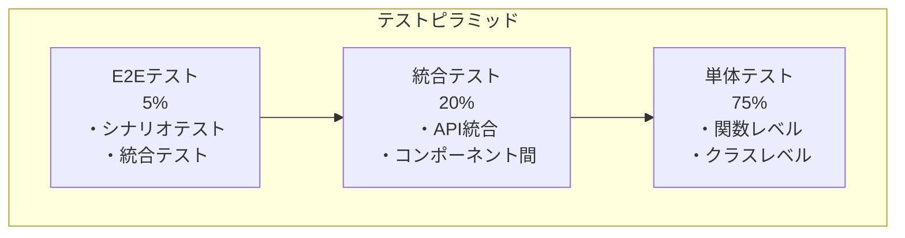

# テスト戦略

## 概要

このドキュメントでは、osobaシステムの品質保証のための包括的なテスト戦略と、自動テストで検証すべき項目を定義します。システムの信頼性と保守性を確保するための体系的なアプローチを提供します。

## テスト分類

### テストピラミッド



## ユニットテスト

| テスト種別 | 目的 | 実行頻度 | 実行時間 |
|-----------|------|----------|----------|
| 単体テスト | 個別機能の正確性 | コミット毎 | < 10秒 |
| 統合テスト | コンポーネント間連携 | PR作成時 | < 5分 |
| E2Eテスト | エンドツーエンドシナリオ | リリース前 | < 30分 |
| パフォーマンステスト | 性能・負荷 | 週次 | < 1時間 |
| セキュリティテスト | 脆弱性検証 | リリース前 | < 15分 |

## 統合テスト

### 1. コアエンジン (internal/watcher/)

#### IssueWatcher

**検証項目:**
```go
// watcher_test.go
func TestIssueWatcher_NewIssueWatcher(t *testing.T) {
    tests := []struct {
        name        string
        client      github.GitHubClient
        owner       string
        repo        string
        sessionName string
        labels      []string
        interval    time.Duration
        expectError bool
    }{
        {
            name:        "valid parameters",
            client:      &mockGitHubClient{},
            owner:       "test-owner",
            repo:        "test-repo", 
            sessionName: "test-session",
            labels:      []string{"status:needs-plan"},
            interval:    time.Second,
            expectError: false,
        },
        {
            name:        "empty owner",
            client:      &mockGitHubClient{},
            owner:       "",
            repo:        "test-repo",
            sessionName: "test-session", 
            labels:      []string{"status:needs-plan"},
            interval:    time.Second,
            expectError: true,
        },
        // ... 他のバリデーションケース
    }
}

func TestIssueWatcher_Start(t *testing.T) {
    // ポーリング機能のテスト
    // コールバック実行のテスト
    // コンテキストキャンセルのテスト
}

func TestIssueWatcher_CheckIssues(t *testing.T) {
    // Issue検知ロジックのテスト
    // フィルタリング条件のテスト
    // エラーハンドリングのテスト
}

func TestIssueWatcher_HealthCheck(t *testing.T) {
    // ヘルスチェック機能のテスト
    // メトリクス収集のテスト
}
```

#### ActionManager

**検証項目:**
```go
// action_manager_test.go
func TestActionManager_ExecuteAction(t *testing.T) {
    tests := []struct {
        name           string
        issue          *github.Issue
        expectedAction string
        expectError    bool
    }{
        {
            name: "plan action for needs-plan label",
            issue: &github.Issue{
                Number: &[]int{123}[0],
                Labels: []*github.Label{
                    {Name: &[]string{"status:needs-plan"}[0]},
                },
            },
            expectedAction: "PlanAction",
            expectError:    false,
        },
        // ... 他のアクションケース
    }
}

func TestActionManager_GetActionForIssue(t *testing.T) {
    // ラベルベースのアクション選択テスト
    // 無効なIssueの処理テスト
}

func TestActionManager_StateManagement(t *testing.T) {
    // 状態管理の整合性テスト
    // 並行アクセス安全性テスト
}
```

### 2. アクション (internal/watcher/actions/)

#### PlanAction

**検証項目:**
```go
// plan_action_test.go
func TestPlanAction_Execute(t *testing.T) {
    tests := []struct {
        name        string
        issue       *github.Issue
        setupMocks  func(*testing.T) (*mockTmux, *mockGit, *mockClaude)
        expectError bool
    }{
        {
            name: "successful plan execution",
            issue: &github.Issue{
                Number: &[]int{123}[0],
                Title:  &[]string{"Test Issue"}[0],
            },
            setupMocks: func(t *testing.T) (*mockTmux, *mockGit, *mockClaude) {
                tmux := &mockTmux{}
                tmux.On("CreateWindowForIssue", "test-session", 123, "plan").Return(nil)
                
                git := &mockGit{}
                git.On("UpdateMainBranch", mock.Anything).Return(nil)
                git.On("CreateWorktree", mock.Anything, 123, git.PhasePlan).Return(nil)
                
                claude := &mockClaude{}
                claude.On("ExecuteInTmux", mock.Anything, mock.Anything, mock.Anything, mock.Anything, mock.Anything).Return(nil)
                
                return tmux, git, claude
            },
            expectError: false,
        },
        // ... エラーケース
    }
}

func TestPlanAction_CanExecute(t *testing.T) {
    // 実行可能性判定のテスト
}

func TestPlanAction_StateTransition(t *testing.T) {
    // 状態遷移の正確性テスト
}
```

#### ImplementationAction & ReviewAction

同様のテストパターンで実装フェーズ、レビューフェーズの検証を行います。

### 3. 統合レイヤー

#### GitHub統合 (internal/github/)

**検証項目:**
```go
// github_client_test.go
func TestGitHubClient_ListIssuesByLabels(t *testing.T) {
    // API呼び出しのテスト
    // レスポンス解析のテスト
    // エラーハンドリングのテスト
}

func TestGitHubClient_LabelOperations(t *testing.T) {
    // ラベル追加・削除のテスト
    // 権限エラーのテスト
    // レート制限対応のテスト
}

func TestGitHubClient_RateLimit(t *testing.T) {
    // レート制限検知のテスト
    // 自動調整機能のテスト
}
```

#### Tmux統合 (internal/tmux/)

**検証項目:**
```go
// tmux_manager_test.go  
func TestTmuxManager_SessionOperations(t *testing.T) {
    // セッション作成・削除のテスト
    // セッション存在確認のテスト
}

func TestTmuxManager_WindowOperations(t *testing.T) {
    // ウィンドウ作成・削除のテスト
    // ウィンドウ切り替えのテスト
    // 命名規則のテスト
}

func TestTmuxManager_ErrorHandling(t *testing.T) {
    // tmux未起動時のエラーハンドリング
    // 権限エラーの処理
}
```

#### Git統合 (internal/git/)

**検証項目:**
```go
// git_worktree_test.go
func TestWorktreeManager_CreateWorktree(t *testing.T) {
    // worktree作成のテスト
    // ブランチ命名のテスト
    // 重複作成時の処理テスト
}

func TestWorktreeManager_UpdateMainBranch(t *testing.T) {
    // mainブランチ更新のテスト
    // コンフリクト処理のテスト
}

func TestWorktreeManager_Cleanup(t *testing.T) {
    // worktree削除のテスト
    // 孤立ブランチクリーンアップのテスト
}
```

#### Claude統合 (internal/claude/)

**検証項目:**
```go
// claude_executor_test.go
func TestClaudeExecutor_ExecuteInTmux(t *testing.T) {
    // Claude実行のテスト
    // テンプレート処理のテスト
    // タイムアウト処理のテスト
}

func TestClaudeExecutor_TemplateProcessing(t *testing.T) {
    // 変数置換のテスト
    // テンプレート検証のテスト
}
```

## テスト実行方針

### 1. コンポーネント間連携

#### Watcher-Action統合

**検証項目:**
```go
// integration_test.go
func TestIssueWatcher_ActionIntegration(t *testing.T) {
    // Issue検知からアクション実行までの流れ
    // 複数Issueの並行処理
    // エラー時の状態整合性
}

func TestActionChain_PhaseTransition(t *testing.T) {
    // Plan -> Implementation -> Review の一連の流れ
    // フェーズ間のデータ引き継ぎ
    // 中断・再開処理
}
```

#### GitHub-Label統合

**検証項目:**
```go
// github_integration_test.go
func TestGitHub_LabelTransition(t *testing.T) {
    // 実際のGitHub APIを使用したラベル操作
    // API制限下での動作確認
    // 権限エラー時の回復処理
}
```

### 2. 外部システム統合

#### tmux システム統合

**検証項目:**
```go
// tmux_integration_test.go
func TestTmux_RealSystem(t *testing.T) {
    // 実際のtmuxサーバーでの動作確認
    // 複数セッション・ウィンドウの管理
    // プロセス終了時のクリーンアップ
}
```

#### git システム統合

**検証項目:**
```go
// git_integration_test.go  
func TestGit_RealRepository(t *testing.T) {
    // 実際のgitリポジトリでの動作確認
    // worktree作成・削除の確認
    // ブランチ管理の確認
}
```

## E2Eテスト (End-to-End Tests)

### 1. 完全シナリオテスト

#### 基本ワークフロー

**検証シナリオ:**
```go
// e2e_basic_workflow_test.go
func TestE2E_BasicWorkflow(t *testing.T) {
    /*
    シナリオ:
    1. Issue作成 (status:needs-plan)
    2. osoba start実行
    3. Plan実行確認
    4. ラベル遷移確認 (needs-plan -> ready)
    5. Implementation実行確認  
    6. ラベル遷移確認 (ready -> review-requested)
    7. Review実行確認
    8. 完了確認
    */
}

func TestE2E_MultipleIssues(t *testing.T) {
    /*
    シナリオ:
    1. 複数Issue同時作成
    2. 並行処理確認
    3. リソース競合回避確認
    4. 全Issue完了確認
    */
}
```

#### エラー回復シナリオ

**検証シナリオ:**
```go
// e2e_error_recovery_test.go
func TestE2E_NetworkFailure(t *testing.T) {
    /*
    シナリオ:
    1. 正常実行開始
    2. ネットワーク障害シミュレート
    3. 自動リトライ確認
    4. 回復後の継続処理確認
    */
}

func TestE2E_PartialFailure(t *testing.T) {
    /*
    シナリオ:
    1. 複数Issue処理開始
    2. 一部Issue処理失敗
    3. 他Issueへの影響なし確認
    4. 失敗Issue回復確認
    */
}
```

### 2. パフォーマンステスト

#### 負荷テスト

**検証項目:**
```go
// performance_test.go
func TestPerformance_HighVolumeIssues(t *testing.T) {
    /*
    テスト条件:
    - 100個のIssue同時処理
    - メモリ使用量監視
    - 処理時間測定
    - エラー率確認
    */
}

func TestPerformance_LongRunning(t *testing.T) {
    /*
    テスト条件:
    - 24時間連続実行
    - メモリリーク検証
    - リソース使用量推移
    - 安定性確認
    */
}
```

#### スケーラビリティテスト

**検証項目:**
```go
// scalability_test.go
func TestScalability_ConcurrentSessions(t *testing.T) {
    /*
    テスト条件:
    - 複数tmuxセッション
    - worktree数の限界確認
    - ディスク使用量監視
    */
}
```

## セキュリティテスト

### 1. 認証・認可テスト

**検証項目:**
```go
// security_test.go
func TestSecurity_TokenValidation(t *testing.T) {
    // 無効トークンでのAPI呼び出し確認
    // 権限不足時のエラーハンドリング
    // トークンローテーション対応
}

func TestSecurity_InputValidation(t *testing.T) {
    // Issue内容のサニタイゼーション
    // コマンドインジェクション防止
    // パストラバーサル攻撃防止
}
```

### 2. データ保護テスト

**検証項目:**
```go
// data_protection_test.go
func TestSecurity_LogSanitization(t *testing.T) {
    // ログ出力時の機密情報マスキング
    // 一時ファイルの適切な削除
    // メモリダンプ時の機密情報保護
}
```

## 自動化とCI/CD統合

### 1. GitHub Actions統合

**ワークフロー設定:**
```yaml
# .github/workflows/test.yml
name: Test Suite

on: [push, pull_request]

jobs:
  unit-test:
    runs-on: ubuntu-latest
    steps:
      - uses: actions/checkout@v4
      - uses: actions/setup-go@v4
        with:
          go-version: '1.21'
      - run: go test -v -race -cover ./...

  integration-test:
    runs-on: ubuntu-latest
    needs: unit-test
    steps:
      - uses: actions/checkout@v4
      - run: make integration-test

  e2e-test:
    runs-on: ubuntu-latest
    needs: integration-test
    if: github.event_name == 'pull_request'
    steps:
      - uses: actions/checkout@v4
      - run: make e2e-test
```

### 2. テスト環境管理

**Docker Compose設定:**
```yaml
# docker-compose.test.yml
version: '3.8'
services:
  osoba-test:
    build: .
    environment:
      - GITHUB_TOKEN=${GITHUB_TOKEN}
      - CLAUDE_API_KEY=${CLAUDE_API_KEY}
    volumes:
      - ./test-data:/test-data
    depends_on:
      - mock-github-api

  mock-github-api:
    image: mockserver/mockserver
    ports:
      - "1080:1080"
    environment:
      - MOCKSERVER_INITIALIZATION_JSON_PATH=/config
    volumes:
      - ./test/mocks:/config
```

## テストデータ管理

### 1. Fixture管理

**テストデータ構造:**
```
test/
├── fixtures/
│   ├── issues/
│   │   ├── valid-plan-issue.json
│   │   ├── valid-impl-issue.json
│   │   └── invalid-issue.json
│   ├── github-responses/
│   │   ├── list-issues-success.json
│   │   └── rate-limit-error.json
│   └── configs/
│       ├── valid-config.yml
│       └── invalid-config.yml
├── mocks/
│   ├── github-api-mock.json
│   └── claude-api-mock.json
└── helpers/
    ├── test-helpers.go
    └── mock-factories.go
```

### 2. Mock実装

**GitHub Client Mock:**
```go
// test/mocks/github_mock.go
type MockGitHubClient struct {
    mock.Mock
}

func (m *MockGitHubClient) ListIssuesByLabels(ctx context.Context, owner, repo string, labels []string) ([]*github.Issue, error) {
    args := m.Called(ctx, owner, repo, labels)
    return args.Get(0).([]*github.Issue), args.Error(1)
}

// ファクトリー関数
func NewMockGitHubClientWithIssues(issues []*github.Issue) *MockGitHubClient {
    mock := &MockGitHubClient{}
    mock.On("ListIssuesByLabels", mock.Anything, mock.Anything, mock.Anything, mock.Anything).Return(issues, nil)
    return mock
}
```

## メトリクスと品質指標

## カバレッジ要件

| コンポーネント | 目標カバレッジ | 測定方法 |
|---------------|--------------|----------|
| コアエンジン | 90%以上 | `go test -cover` |
| アクション | 85%以上 | 統合テスト含む |
| 統合レイヤー | 80%以上 | モック使用 |
| E2E | 主要シナリオ100% | 実環境テスト |

### 2. 品質ゲート

**PR マージ条件:**
- [ ] 全単体テストPass
- [ ] 統合テストPass  
- [ ] カバレッジ閾値達成
- [ ] 静的解析Pass
- [ ] セキュリティチェックPass

**リリース条件:**
- [ ] E2EテストPass
- [ ] パフォーマンステストPass
- [ ] セキュリティテストPass
- [ ] ドキュメント更新完了

### 3. 継続的改善

**月次レビュー項目:**
- テスト実行時間の推移
- カバレッジの推移
- 不安定テストの特定と修正
- 新しいテストケースの追加

## 実行コマンド

### 開発者向けコマンド

```bash
# 全単体テスト実行
make test

# カバレッジ付きテスト実行
make test-coverage

# 統合テスト実行
make integration-test

# E2Eテスト実行（要：実環境設定）
make e2e-test

# パフォーマンステスト実行
make performance-test

# セキュリティテスト実行
make security-test

# 全テストスイート実行
make test-all
```

### CI/CD用コマンド

```bash
# 並行テスト実行
make test-parallel

# JUnit形式レポート生成
make test-report

# カバレッジレポート生成
make coverage-report

# テスト結果アーカイブ
make test-archive
```

## まとめ

この包括的なテスト戦略により、osobaシステムの品質と信頼性を確保します。テストピラミッドに基づく段階的なテスト実行、自動化されたCI/CD統合、そして継続的な品質改善により、開発速度と品質のバランスを最適化します。

新機能開発時は、この戦略に基づいてテストケースを作成し、既存のテストとの整合性を保ちながら、システム全体の品質向上を図ります。