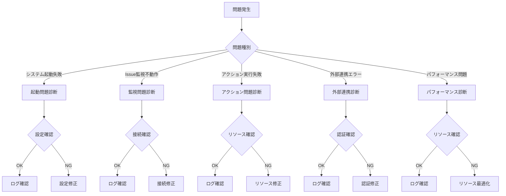

# トラブルシューティングガイド

## 概要

このガイドでは、osoba開発・運用中に発生する可能性のある問題とその解決方法について説明します。システムの健全性維持とデバッグ効率化のための包括的な情報を提供します。

## 一般的な問題と解決方法

### 問題診断フローチャート



## Issue検知の問題

### 1. 設定ファイル関連

#### 問題: 設定ファイルが見つからない

**症状:**
```
Error: failed to initialize config: config file not found
```

**原因と解決策:**

| 原因 | 解決策 | コマンド例 |
|------|--------|-----------|
| 設定ファイルパス間違い | 正しいパスを指定 | `osoba start -c ~/.config/osoba/osoba.yml` |
| 設定ファイル未作成 | サンプルから作成 | `cp osoba.yml.sample ~/.config/osoba/osoba.yml` |
| 権限不足 | ファイル権限修正 | `chmod 644 ~/.config/osoba/osoba.yml` |

**診断コマンド:**
```bash
# 設定ファイル存在確認
ls -la ~/.config/osoba/osoba.yml

# 設定ファイル内容確認
cat ~/.config/osoba/osoba.yml

# 設定パス確認
osoba start --config=/path/to/config.yml --verbose
```

#### 問題: 設定値が無効

**症状:**
```
Error: invalid configuration: poll_interval must be at least 1 second
```

**診断と修正:**
```bash
# 設定検証
osoba start --verbose --config=./test-config.yml

# 設定値確認（YAML形式で）
cat << EOF > valid-config.yml
github:
  token: "${GITHUB_TOKEN}"
  poll_interval: "30s"
tmux:
  session_prefix: "osoba-"
EOF
```

### 2. 認証問題

#### 問題: GitHub Token認証失敗

**症状:**
```
Error: GitHub API authentication failed: 401 Unauthorized
```

**解決手順:**

1. **トークン確認**
```bash
# 環境変数確認
echo $GITHUB_TOKEN

# トークン有効性テスト
curl -H "Authorization: token $GITHUB_TOKEN" \
     https://api.github.com/user
```

2. **権限確認**
   - 必要スコープ: `repo`, `read:org`
   - GitHub Settings → Developer settings → Personal access tokens

3. **設定更新**
```yaml
github:
  token: "ghp_xxxxxxxxxxxxxxxxxxxx"  # 実際のトークンに更新
```

#### 問題: Claude API認証失敗

**症状:**
```
Error: Claude API authentication failed
```

**解決手順:**

1. **APIキー確認**
```bash
# 環境変数確認
echo $CLAUDE_API_KEY

# APIキー有効性テスト
curl -H "Authorization: Bearer $CLAUDE_API_KEY" \
     https://api.anthropic.com/v1/models
```

2. **設定更新**
```yaml
claude:
  api_key: "${CLAUDE_API_KEY}"
  model: "claude-3-sonnet"
```

## tmuxセッションの問題

### 1. Issue検知不良

#### 問題: Issueが検知されない

**症状:**
- ラベル付きIssueが存在するが処理されない
- ログに「processed issues: 0」が継続

**診断ステップ:**

1. **GitHub API接続確認**
```bash
# レート制限確認
osoba status --verbose

# 手動API呼び出し
curl -H "Authorization: token $GITHUB_TOKEN" \
     "https://api.github.com/repos/owner/repo/issues?labels=status:needs-plan"
```

2. **ラベル設定確認**
```bash
# 設定されたラベル確認
grep -A 5 "labels:" ~/.config/osoba/osoba.yml

# リポジトリラベル一覧
gh api repos/owner/repo/labels --jq '.[].name'
```

3. **ログ分析**
```bash
# Issue検知ログ確認
osoba start --verbose --log-level=debug 2>&1 | grep "Issue check"

# 詳細デバッグログ
osoba start --verbose 2>&1 | grep -E "(issue|label|process)"
```

**よくある原因と解決策:**

| 原因 | 解決策 |
|------|-------|
| ラベル名の不一致 | 設定ファイルとGitHubラベルの一致確認 |
| Issue状態がClosed | Open状態のIssueのみ監視対象 |
| 権限不足 | リポジトリアクセス権限確認 |
| API制限 | ポーリング間隔の延長 |

### 2. ポーリング問題

#### 問題: ポーリング頻度が異常

**症状:**
- API制限に頻繁に抵触
- レスポンス遅延

**対策:**

1. **適切なポーリング間隔設定**
```yaml
github:
  poll_interval: "60s"  # デフォルト30sから延長
```

2. **レート制限監視**
```bash
# 現在のレート制限確認
osoba status --rate-limit

# リアルタイム監視
watch -n 30 'osoba status --rate-limit'
```

## git worktreeの問題

### 1. tmux関連問題

#### 問題: tmuxセッション作成失敗

**症状:**
```
Error: failed to create tmux window: session not found
```

**診断と解決:**

1. **tmux状態確認**
```bash
# tmuxセッション一覧
tmux list-sessions

# osobaセッション確認
tmux list-sessions | grep osoba

# セッション手動作成
tmux new-session -d -s osoba-test
```

2. **権限確認**
```bash
# tmuxサーバー状態
tmux info

# プロセス確認
ps aux | grep tmux
```

3. **設定確認**
```yaml
tmux:
  session_prefix: "osoba-"
  auto_attach: true
```

#### 問題: tmuxウィンドウ作成失敗

**症状:**
```
Error: failed to create window: window already exists
```

**解決手順:**

1. **既存ウィンドウ確認**
```bash
# 全ウィンドウ確認
tmux list-windows -t osoba-session

# Issue固有ウィンドウ確認
tmux list-windows -t osoba-session | grep "123-plan"
```

2. **ウィンドウクリーンアップ**
```bash
# 特定ウィンドウ削除
tmux kill-window -t osoba-session:123-plan

# 全ウィンドウクリーンアップ
osoba clean --windows
```

### 2. git worktree問題

#### 問題: worktree作成失敗

**症状:**
```
Error: failed to create worktree: worktree already exists
```

**診断と解決:**

1. **worktree状態確認**
```bash
# worktree一覧
git worktree list

# Issue固有worktree確認
git worktree list | grep "123-plan"

# ディスク使用量確認
du -sh .git/worktrees/*
```

2. **worktreeクリーンアップ**
```bash
# 特定worktree削除
git worktree remove .git/worktrees/123-plan

# 全worktreeクリーンアップ
osoba clean --worktrees

# 孤立したworktree修復
git worktree prune
```

#### 問題: ディスク容量不足

**症状:**
```
Error: failed to create worktree: no space left on device
```

**対策:**

1. **容量確認**
```bash
# ディスク使用量
df -h

# osoba関連ディスク使用量
du -sh .git/worktrees/
du -sh ~/.config/osoba/
```

2. **クリーンアップ**
```bash
# 古いworktreeクリーンアップ
osoba clean --all --force

# 未使用ブランチ削除
git branch -D $(git branch | grep "osoba/#")
```

### 3. Claude実行問題

#### 問題: Claude実行タイムアウト

**症状:**
```
Error: Claude execution timeout after 10m
```

**対策:**

1. **タイムアウト延長**
```yaml
claude:
  phases:
    implement:
      timeout: "30m"  # デフォルト10mから延長
```

2. **実行状況確認**
```bash
# tmuxセッション内の実行確認
tmux capture-pane -t osoba-session:123-implement -p

# プロセス確認
ps aux | grep claude
```

3. **ログ確認**
```bash
# Claude実行ログ
tail -f /var/log/osoba/claude-execution.log

# エラー詳細
grep -A 10 -B 10 "Claude execution" /var/log/osoba/osoba.log
```

## Claude実行の問題

### 1. GitHub API問題

#### 問題: API制限超過

**症状:**
```
Error: GitHub API rate limit exceeded
```

**対策:**

1. **レート制限確認**
```bash
# 現在のレート制限
curl -H "Authorization: token $GITHUB_TOKEN" \
     https://api.github.com/rate_limit

# リセット時刻確認
osoba status --rate-limit
```

2. **設定調整**
```yaml
github:
  poll_interval: "120s"  # 間隔を長く
  max_concurrent: 1      # 並行処理数を制限
```

#### 問題: ラベル操作失敗

**症状:**
```
Error: failed to add label: 422 Unprocessable Entity
```

**診断と解決:**

1. **ラベル存在確認**
```bash
# リポジトリラベル確認
gh api repos/owner/repo/labels --jq '.[].name'

# 必要ラベル作成
gh api repos/owner/repo/labels -f name="status:needs-plan" -f color="0366d6"
```

2. **権限確認**
```bash
# リポジトリ権限確認
gh api repos/owner/repo --jq '.permissions'
```

### 2. ネットワーク問題

#### 問題: 接続タイムアウト

**症状:**
```
Error: connection timeout to api.github.com
```

**診断:**

1. **ネットワーク確認**
```bash
# DNS解決確認
nslookup api.github.com

# 接続テスト
curl -I https://api.github.com

# タイムアウト時間確認
time curl https://api.github.com
```

2. **プロキシ設定確認**
```bash
# プロキシ環境変数確認
echo $HTTP_PROXY
echo $HTTPS_PROXY

# プロキシ設定（必要に応じて）
export HTTPS_PROXY=http://proxy.example.com:8080
```

## ラベル遷移の問題

### 1. メモリ使用量問題

#### 問題: メモリ不足

**症状:**
```
Error: out of memory
```

**診断と対策:**

1. **メモリ使用量確認**
```bash
# プロセスメモリ使用量
ps aux | grep osoba

# システムメモリ確認
free -h

# メモリ使用量監視
top -p $(pgrep osoba)
```

2. **メモリ最適化設定**
```yaml
performance:
  max_concurrent_issues: 2     # 並行処理数制限
  issue_cache_size: 100       # キャッシュサイズ制限
  gc_interval: "5m"           # GC実行間隔
```

### 2. CPU使用率問題

#### 問題: CPU使用率が高い

**症状:**
- システム全体のレスポンス低下
- Claude実行時のCPU 100%使用

**対策:**

1. **CPU使用率確認**
```bash
# CPU使用率監視
htop

# osoba関連プロセス確認
pidstat -p $(pgrep osoba) 1
```

2. **負荷分散設定**
```yaml
performance:
  max_cpu_percent: 80         # CPU使用率上限
  nice_level: 10              # プロセス優先度
  concurrent_actions: 1       # 並行アクション数制限
```

## デバッグ手法

### 1. システム状態確認

```bash
# 基本状態確認
osoba status

# 詳細状態確認（全情報）
osoba status --verbose --all

# ヘルスチェック
osoba status --health

# パフォーマンス統計
osoba status --metrics
```

## ログ解析

```bash
# エラーログ抽出
grep -i error /var/log/osoba/osoba.log

# 特定Issue関連ログ
grep "issue.*123" /var/log/osoba/osoba.log

# 時間範囲指定ログ
journalctl -u osoba --since "1 hour ago"

# リアルタイムログ監視
tail -f /var/log/osoba/osoba.log | grep -E "(ERROR|WARN)"
```

### 3. デバッグコマンド

```bash
# デバッグモード起動
osoba start --verbose --log-level=debug

# 単発Issue処理テスト
osoba debug process-issue --issue=123

# 設定検証
osoba debug validate-config

# 依存関係確認
osoba debug check-dependencies
```

## よくあるエラーと解決策

### エラーコード別対応表

| エラーコード | 説明 | 主な原因 | 解決策 |
|-------------|------|---------|-------|
| OSB001 | 設定ファイルエラー | 設定形式不正 | YAML書式確認 |
| OSB002 | GitHub API認証失敗 | トークン無効 | トークン再発行 |
| OSB003 | tmux操作失敗 | tmux未起動 | tmux再起動 |
| OSB004 | git操作失敗 | 権限不足 | git設定確認 |
| OSB005 | Claude実行失敗 | APIキー無効 | APIキー確認 |
| OSB006 | リソース不足 | メモリ/ディスク不足 | リソース解放 |
| OSB007 | ネットワークエラー | 接続失敗 | 接続環境確認 |
| OSB008 | 排他制御エラー | 同時実行競合 | 処理完了待機 |

### 緊急時対応手順

#### 1. サービス異常時の緊急停止

```bash
# 安全な停止
osoba stop --graceful

# 強制停止（緊急時のみ）
pkill -f osoba

# 関連プロセス確認・停止
ps aux | grep -E "(osoba|claude)" | awk '{print $2}' | xargs kill
```

#### 2. 状態リセット

```bash
# 処理状態リセット
osoba clean --state

# 全リソースクリーンアップ
osoba clean --all --force

# 設定リセット
osoba init --reset
```

#### 3. バックアップからの復旧

```bash
# 設定バックアップから復旧
cp ~/.config/osoba/osoba.yml.backup ~/.config/osoba/osoba.yml

# ログバックアップ確認
ls -la /var/log/osoba/backup/

# 状態ファイル復旧
cp ~/.osoba/state.json.backup ~/.osoba/state.json
```

## 予防保守

### 1. 定期実行チェック

```bash
# 日次チェック
#!/bin/bash
osoba status --health > /tmp/osoba-health.log
if [ $? -ne 0 ]; then
    echo "osoba health check failed" | mail -s "osoba Alert" admin@example.com
fi

# 週次クリーンアップ
osoba clean --old-worktrees --days=7
osoba clean --old-logs --days=30
```

### 2. 監視設定

```yaml
# monitoring.yml
alerts:
  health_check_interval: "5m"
  error_threshold: 5
  memory_threshold: "80%"
  disk_threshold: "90%"
  
notifications:
  email: "admin@example.com"
  slack_webhook: "https://hooks.slack.com/..."
```

### 3. バックアップ戦略

```bash
# 設定ファイルバックアップ
cp ~/.config/osoba/osoba.yml ~/.config/osoba/osoba.yml.$(date +%Y%m%d)

# 状態ファイルバックアップ
cp ~/.osoba/state.json ~/.osoba/state.json.$(date +%Y%m%d)

# ログローテーション
logrotate /etc/logrotate.d/osoba
```

## サポート情報

### 1. 情報収集

問題報告時に以下の情報を収集してください：

```bash
# システム情報収集スクリプト
#!/bin/bash
echo "=== System Information ===" > osoba-debug.log
uname -a >> osoba-debug.log
go version >> osoba-debug.log

echo "=== osoba Status ===" >> osoba-debug.log
osoba status --verbose >> osoba-debug.log

echo "=== Configuration ===" >> osoba-debug.log
cat ~/.config/osoba/osoba.yml >> osoba-debug.log

echo "=== Recent Logs ===" >> osoba-debug.log
tail -100 /var/log/osoba/osoba.log >> osoba-debug.log

echo "=== Process Information ===" >> osoba-debug.log
ps aux | grep osoba >> osoba-debug.log
```

### 2. 問題報告テンプレート

```markdown
## 問題の詳細
- **発生日時**: YYYY-MM-DD HH:MM:SS
- **症状**: [詳細な症状説明]
- **再現手順**: [問題再現のための手順]
- **期待動作**: [期待されていた動作]

## 環境情報
- **OS**: [OS名とバージョン]
- **Go Version**: [go version出力]
- **osoba Version**: [osoba --version出力]

## エラーログ
```
[関連するエラーログ]
```

## 設定ファイル
```yaml
[匿名化された設定ファイル]
```
```

### 3. 連絡先

- **GitHub Issues**: https://github.com/douhashi/osoba/issues
- **ドキュメント**: docs/development/
- **開発者ガイド**: docs/development/go-coding-standards.md

## まとめ

このガイドでは、osoba運用時の主要な問題パターンと解決策を包括的に示しました。問題の早期発見と迅速な解決のため、定期的な監視と予防保守を実施することを推奨します。

新しい問題パターンが発見された場合は、このガイドを更新し、知見を共有することで、開発チーム全体の問題解決能力向上を図ります。