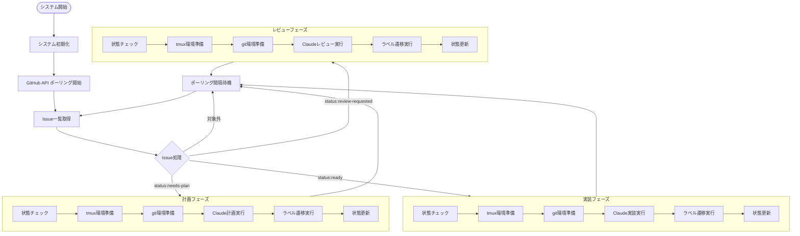
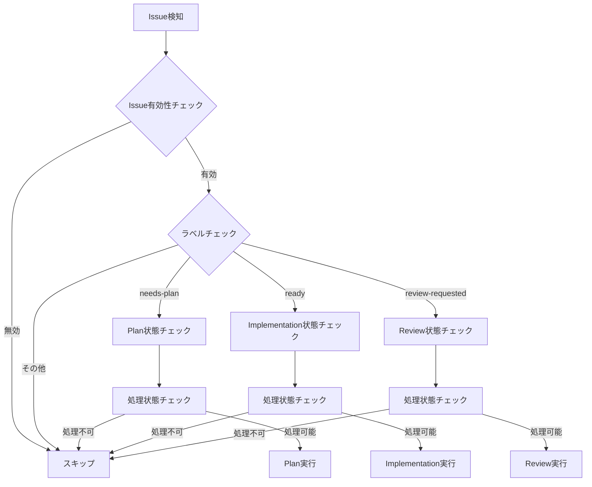
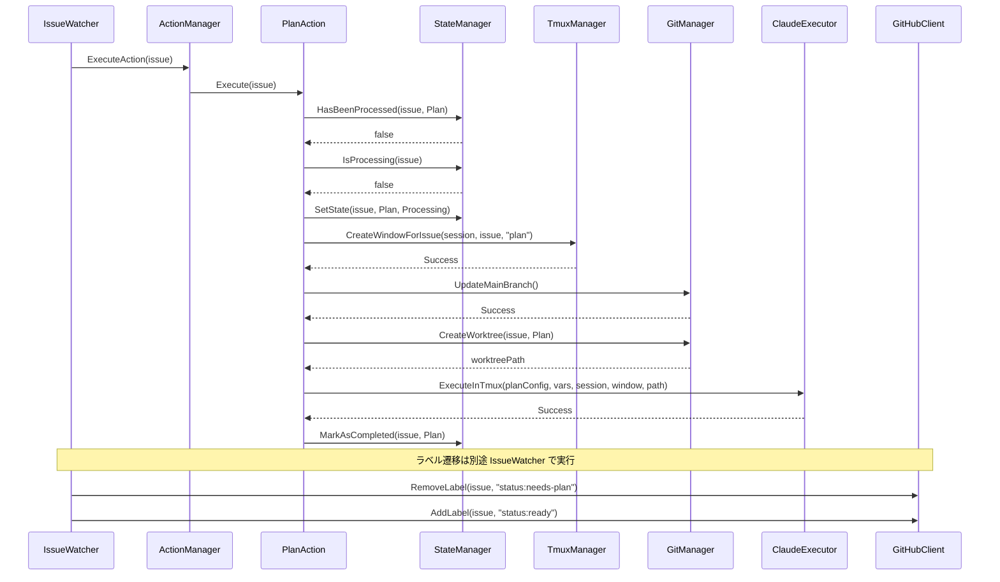
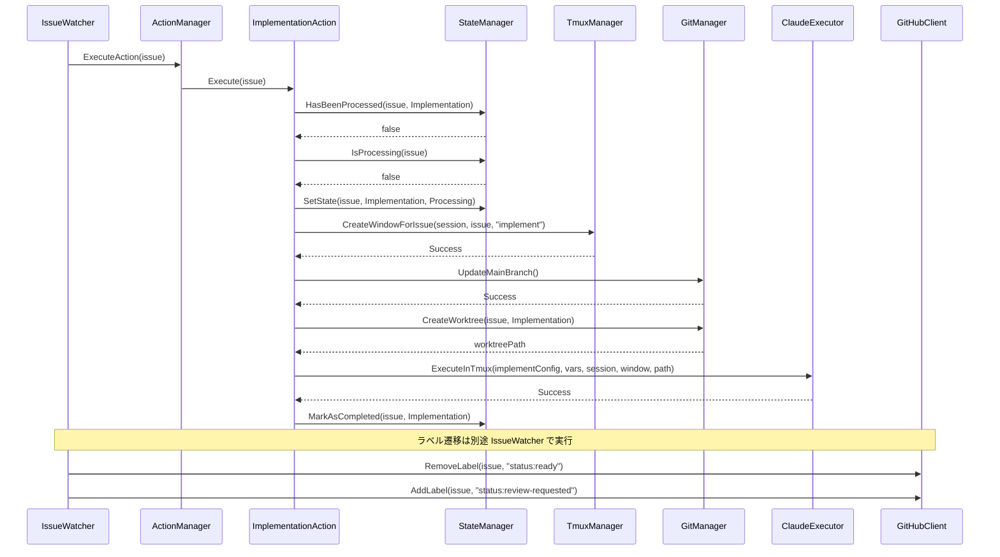
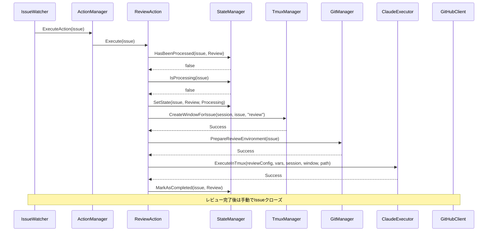
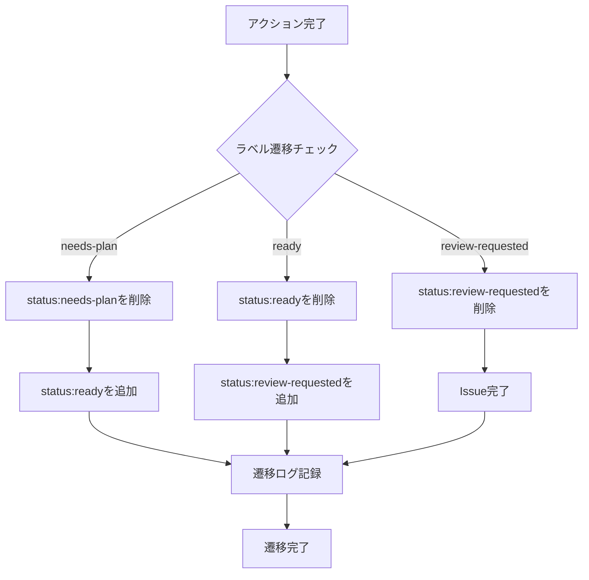
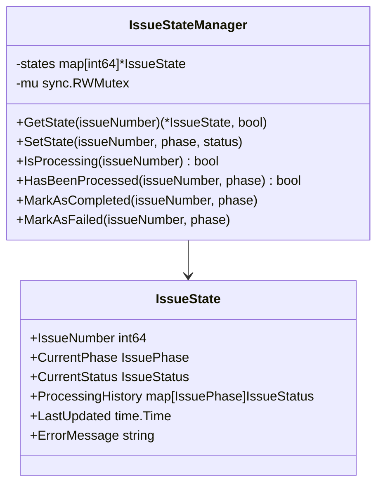
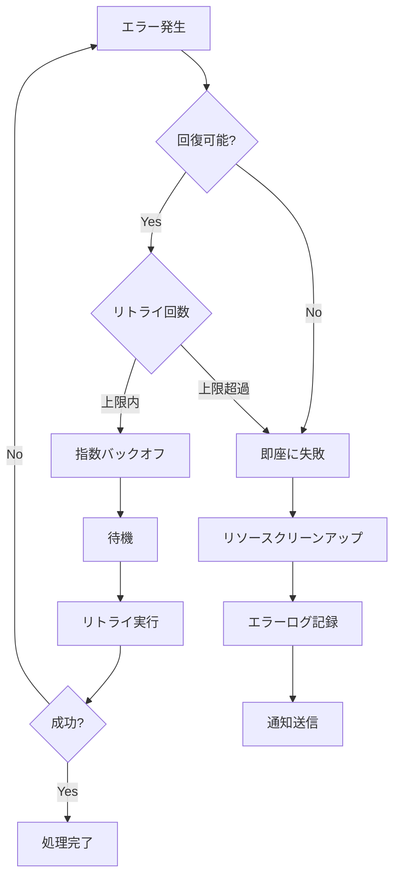

# ワークフロー仕様書

## 概要

この仕様書では、osobaシステムにおけるIssue検知からラベル遷移までの全処理フローと、各フェーズで期待される動作について詳細に定義します。

## 3フェーズ処理フロー

### メインフロー



## Issue検知メカニズム

### 検知条件

| 条件 | 説明 | 実装 |
|------|------|------|
| ラベル一致 | 監視対象ラベルが付与されたIssue | `ShouldProcessIssue()` |
| 状態未処理 | 該当フェーズで未処理のIssue | `HasBeenProcessed()` |
| 処理中でない | 他のフェーズで処理中でないIssue | `IsProcessing()` |
| Issue有効 | オープン状態のIssue | GitHub API応答 |

### 検知ロジック



## フェーズ別詳細仕様

### 計画フェーズ

#### トリガー条件
- Issue ラベル: `status:needs-plan`
- Issue 状態: Open
- 処理状態: 未処理かつ非処理中

#### 処理ステップ



#### 期待される動作

1. **状態検証**
   - Issue処理履歴の確認
   - 同時処理防止チェック
   - 処理状態の更新

2. **環境準備**
   - tmux window作成: `{issue_number}-plan`
   - main branchの最新化
   - 計画用worktreeの作成

3. **Claude実行**
   - 計画テンプレートの処理
   - tmux window内でのClaude実行
   - 実行結果の確認

4. **完了処理**
   - 処理状態の完了マーク
   - ラベル遷移: `status:needs-plan` → `status:ready`

#### 作成されるリソース

- tmux window: `{session_name}:{issue_number}-plan`
- git worktree: `.git/worktrees/{issue_number}-plan`
- git branch: `{prefix}#{issue_number}-plan`

### 実装フェーズ

#### トリガー条件
- Issue ラベル: `status:ready`
- Issue 状態: Open
- 処理状態: 未処理かつ非処理中

#### 処理ステップ



#### 期待される動作

1. **状態検証**
   - Issue処理履歴の確認
   - 同時処理防止チェック
   - 処理状態の更新

2. **環境準備**
   - tmux window作成: `{issue_number}-implement`
   - main branchの最新化
   - 実装用worktreeの作成（独立したworktree）

3. **Claude実行**
   - 実装テンプレートの処理
   - TDD（テスト駆動開発）による実装
   - テスト実行とビルド確認

4. **完了処理**
   - 処理状態の完了マーク
   - ラベル遷移: `status:ready` → `status:review-requested`

#### 作成されるリソース

- tmux window: `{session_name}:{issue_number}-implement`
- git worktree: `.git/worktrees/{issue_number}-implementation`
- git branch: `{prefix}#{issue_number}-implementation`

### レビューフェーズ

#### トリガー条件
- Issue ラベル: `status:review-requested`
- Issue 状態: Open
- 処理状態: 未処理かつ非処理中

#### 処理ステップ



#### 期待される動作

1. **状態検証**
   - Issue処理履歴の確認
   - 同時処理防止チェック
   - 処理状態の更新

2. **環境準備**
   - tmux window作成: `{issue_number}-review`
   - レビュー用環境の準備
   - 実装結果の確認

3. **Claude実行**
   - レビューテンプレートの処理
   - コード品質チェック
   - PR作成・マージの実行

4. **完了処理**
   - 処理状態の完了マーク
   - Issue完了（手動またはPR統合時）

#### 作成されるリソース

- tmux window: `{session_name}:{issue_number}-review`
- Pull Request（必要に応じて）

## ラベル遷移仕様

### ラベル遷移マッピング

| フェーズ | トリガーラベル | 処理中ラベル | 完了時ラベル | 備考 |
|----------|---------------|-------------|-------------|------|
| Plan | `status:needs-plan` | `status:planning` | `status:ready` | 計画フェーズ |
| Implementation | `status:ready` | `status:implementing` | `status:review-requested` | 実装フェーズ |
| Review | `status:review-requested` | `status:reviewing` | 完了 | レビューフェーズ |

### ラベル遷移ロジック



### エラー時のラベル戦略

| エラー状況 | ラベル操作 | 理由 |
|-----------|-----------|------|
| 環境準備失敗 | ラベル変更なし | リトライ可能性を保持 |
| Claude実行失敗 | ラベル変更なし | 再実行可能性を保持 |
| 遷移失敗 | エラーラベル追加 | 手動介入が必要 |
| システムエラー | 状態保持 | 復旧後の自動再開 |

## 状態管理仕様

### Issue状態定義

```go
type IssuePhase int

const (
    IssueStatePlan         IssuePhase = iota  // 計画フェーズ
    IssueStateImplementation                   // 実装フェーズ  
    IssueStateReview                          // レビューフェーズ
)

type IssueStatus int

const (
    IssueStatusPending     IssueStatus = iota // 待機中
    IssueStatusProcessing                     // 処理中
    IssueStatusCompleted                      // 完了
    IssueStatusFailed                         // 失敗
)
```

### 状態遷移ルール

1. **順次処理**: フェーズは Plan → Implementation → Review の順で実行
2. **排他制御**: 同一Issueで複数フェーズの同時実行は禁止
3. **冪等性**: 同一フェーズの重複実行は安全にスキップ
4. **失敗回復**: 失敗状態からの自動回復機能

### 状態永続化



## エラーハンドリング仕様

### エラー分類

| エラー種別 | 説明 | 回復戦略 | 実装 |
|-----------|------|----------|------|
| 一時的エラー | ネットワーク、API制限 | 自動リトライ | `RetryWithBackoff()` |
| 設定エラー | 無効な設定値 | 即座に失敗 | バリデーション |
| リソースエラー | ディスク容量、権限 | 管理者通知 | ログ記録 |
| 論理エラー | プログラムバグ | 開発者通知 | スタックトレース |

### リトライ戦略



### エラー通知

1. **ログ記録**: 全エラーを構造化ログで記録
2. **メトリクス**: エラー率、失敗パターンの監視
3. **アラート**: 閾値超過時の自動通知
4. **回復**: 可能な場合の自動回復処理

## パフォーマンス仕様

### ポーリング設定

| 項目 | デフォルト値 | 説明 |
|------|-------------|------|
| ポーリング間隔 | 30秒 | GitHub API呼び出し間隔 |
| API制限対応 | 自動調整 | レート制限検知時の動的調整 |
| 同時処理数 | 3 | 並行Issue処理数上限 |
| タイムアウト | 10分 | 単一アクションの最大実行時間 |

### リソース管理

1. **メモリ使用量**: Issue数に比例、上限1GB
2. **ディスク使用量**: worktree容量監視、自動クリーンアップ
3. **CPU使用量**: Claude実行時の一時的高負荷
4. **ネットワーク**: GitHub API使用量の監視

## 監視・ログ仕様

### ログレベル定義

| レベル | 用途 | 出力内容 |
|--------|------|----------|
| DEBUG | 開発・デバッグ | 詳細な実行トレース |
| INFO | 通常運用 | 主要イベント、状態変化 |
| WARN | 注意喚起 | 回復可能なエラー、設定問題 |
| ERROR | エラー対応 | 処理失敗、システムエラー |

### 監視メトリクス

1. **処理統計**
   - Issue処理数（成功/失敗）
   - フェーズ別処理時間
   - エラー率・パターン

2. **システム統計**
   - API呼び出し回数・レート
   - リソース使用量
   - 応答時間

3. **ビジネス統計**
   - 開発速度向上効果
   - 自動化カバレッジ
   - 開発者満足度

## tmux統合

## git worktree管理

## 設定仕様

### 設定ファイル構造

```yaml
github:
  token: "${GITHUB_TOKEN}"
  owner: "douhashi"
  repo: "osoba"
  poll_interval: "30s"
  labels:
    plan: "status:needs-plan"
    ready: "status:ready"
    review: "status:review-requested"

tmux:
  session_prefix: "osoba-"
  auto_attach: true

claude:
  api_key: "${CLAUDE_API_KEY}"
  model: "claude-3-sonnet"
  phases:
    plan:
      template: "cmd/templates/commands/plan.md"
      timeout: "10m"
    implement:
      template: "cmd/templates/commands/implement.md"
      timeout: "30m"
    review:
      template: "cmd/templates/commands/review.md"
      timeout: "15m"

log:
  level: "info"
  format: "json"
  file: "/var/log/osoba/osoba.log"
```

### 設定の優先順位

1. コマンドラインオプション
2. 環境変数
3. プロジェクト設定ファイル
4. ユーザー設定ファイル
5. システムデフォルト

## セキュリティ仕様

### 認証・認可

1. **GitHub Token**: 読み取り・書き込み権限の最小化
2. **Claude API Key**: 暗号化保存、メモリクリア
3. **ローカルファイル**: 適切なファイル権限設定

### 入力検証

1. **Issue内容**: XSS、コマンドインジェクション防止
2. **ラベル名**: 予期しないラベル操作防止
3. **設定値**: 範囲・形式チェック

### データ保護

1. **機密情報マスキング**: ログ出力時の自動マスキング
2. **一時ファイル**: 処理後の確実な削除
3. **通信暗号化**: HTTPS、TLS使用

## まとめ

この仕様書では、osobaシステムの完全なワークフローを定義しました。Issue検知から各フェーズの実行、ラベル遷移まで、すべてのステップが明確に文書化されており、開発者は仕様に基づいて確実な実装・運用が可能です。

各フェーズの期待動作、エラーハンドリング、状態管理が詳細に規定されているため、機能追加や変更時の影響範囲の把握、デバッグ時の原因特定が効率的に行えます。