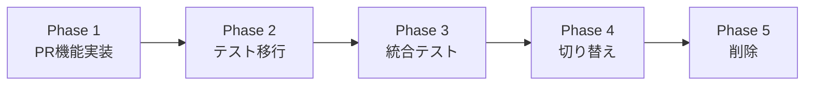

# GitHub Client完全移行計画書

## エグゼクティブサマリー

本計画書は、osobaシステムのGitHubクライアント実装を`internal/github`（HTTP API）から`internal/gh`（ghコマンド）へ完全移行するための包括的な戦略を定義します。

### 目標
1. ghコマンドベースの統一された実装の実現
2. テストの完全な互換性確保
3. システムの安定性向上

### 成功基準
- internal/ghに全25メソッドが実装される
- internal/githubの全76テストがinternal/ghで動作する
- internal/githubパッケージが完全に削除可能となる

## 現状分析

### パッケージ比較
| 項目 | internal/github | internal/gh |
|---|---|---|
| 実装方式 | HTTP API直接呼び出し | ghコマンド実行 |
| メソッド実装率 | 25/25 (100%) | 19/25 (76%) |
| テスト数 | 76 | 16 |
| 依存ファイル数 | 60+ | 3 |
| コード行数 | 約5,000行 | 約1,500行 |

### ghコマンドの優位性
1. **認証の簡潔性**: ghコマンドの認証機構を活用
2. **APIバージョン管理**: GitHub CLIが自動的に対応
3. **保守性**: GitHubの仕様変更への追従が容易
4. **統一性**: CLIツールとの一貫性

## 移行戦略

### 基本方針
- **段階的移行**: 機能ごとに実装とテストを移行
- **互換性重視**: 既存インターフェースを完全に維持
- **テスト駆動**: テストが通ることを移行完了の条件とする

### 移行フェーズ

## 実装計画

### Phase 1: PR機能実装（2週間）

**目標**: internal/ghに不足している6つのメソッドを実装

**タスク**:
1. GetPullRequestForIssue実装
2. MergePullRequest実装
3. GetPullRequestStatus実装
4. ListPullRequestsByLabels実装
5. GetClosingIssueNumber実装
6. TransitionLabels実装

**成果物**:
- 実装済みのPR関連メソッド
- 単体テスト

### Phase 2: テスト移行（1週間）

**目標**: internal/githubのテストをinternal/ghで実行可能にする

**タスク**:
1. テストヘルパーの移植
2. モック実装の調整
3. テストケースの移行（76個）
4. カバレッジ測定

**成果物**:
- 移行済みテストスイート
- カバレッジレポート（目標: 85%以上）

### Phase 3: 統合テスト（1週間）

**目標**: 実環境での動作確認

**タスク**:
1. E2Eテストの実装
2. パフォーマンステスト
3. 並行実行テスト
4. エラーケーステスト

**成果物**:
- 統合テストスイート
- パフォーマンス比較レポート

### Phase 4: 段階的切り替え（1週間）

**目標**: 本番環境での段階的移行

**タスク**:
1. フィーチャーフラグ実装
2. カナリアリリース
3. モニタリング設定
4. ロールバック準備

**成果物**:
- 切り替え可能な実装
- モニタリングダッシュボード

### Phase 5: 旧実装削除（3日）

**目標**: internal/githubパッケージの完全削除

**タスク**:
1. 依存関係の最終確認
2. internal/githubの削除
3. ドキュメント更新
4. リリースノート作成

**成果物**:
- クリーンなコードベース
- 更新済みドキュメント

## リスク管理

### 識別されたリスク

| リスク | 影響 | 確率 | 対策 |
|---|---|---|---|
| ghコマンドのパフォーマンス低下 | 高 | 中 | 並列実行、キャッシング実装 |
| API互換性の問題 | 高 | 低 | 詳細なテストカバレッジ |
| 認証方式の違いによる障害 | 中 | 低 | 事前の環境検証 |
| テスト移行の複雑性 | 中 | 中 | 段階的な移行 |

### リスク軽減策
1. **並列開発環境**: 両実装を並行稼働
2. **フィーチャーフラグ**: 実行時切り替え
3. **包括的テスト**: 全機能の自動テスト
4. **段階的ロールアウト**: 部分的な切り替え

## 実装詳細

詳細な実装仕様は以下のドキュメントを参照:
- [01-missing-features.md](01-missing-features.md): 未実装機能の詳細
- [02-implementation-guide.md](02-implementation-guide.md): 実装ガイド
- [03-test-migration.md](03-test-migration.md): テスト移行戦略
- [04-validation-checklist.md](04-validation-checklist.md): 検証チェックリスト

## スケジュール

### マイルストーン
| フェーズ | 開始日 | 完了予定日 | 期間 |
|---|---|---|---|
| Phase 1: PR機能実装 | Day 1 | Day 14 | 2週間 |
| Phase 2: テスト移行 | Day 15 | Day 21 | 1週間 |
| Phase 3: 統合テスト | Day 22 | Day 28 | 1週間 |
| Phase 4: 段階的切り替え | Day 29 | Day 35 | 1週間 |
| Phase 5: 旧実装削除 | Day 36 | Day 38 | 3日 |

**総期間**: 約5.5週間

## 成功指標

### 定量的指標
- [ ] 全25メソッドの実装完了
- [ ] テストカバレッジ85%以上
- [ ] 全76テストの成功
- [ ] パフォーマンス劣化20%以内
- [ ] ゼロダウンタイムでの移行

### 定性的指標
- [ ] コードの可読性向上
- [ ] 保守性の改善
- [ ] 開発者体験の向上
- [ ] ドキュメントの完全性

## チーム体制

### 役割分担
- **実装担当**: PR機能の実装、テスト作成
- **テスト担当**: テスト移行、統合テスト
- **レビュー担当**: コードレビュー、品質保証
- **インフラ担当**: 環境準備、モニタリング

## 次のステップ

1. **承認**: 本計画書の承認を得る
2. **環境準備**: 開発環境の設定
3. **Phase 1開始**: PR機能の実装に着手

## 参考資料

- [GitHub CLI Documentation](https://cli.github.com/manual/)
- [GitHub REST API Documentation](https://docs.github.com/en/rest)
- [GitHub GraphQL API Documentation](https://docs.github.com/en/graphql)

---

**作成日**: 2025-08-13
**作成者**: osoba開発チーム
**バージョン**: 1.0.0